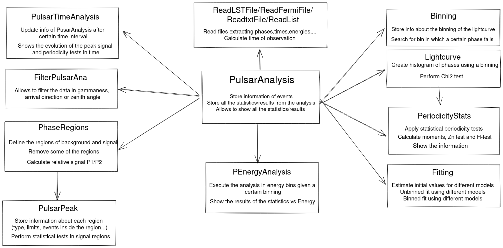

# PulsarPhaseogram

The intention of this repository is to present a package with all the tools needed to perform the periodicity analysis of pulsars at Very High Energy using Python. 

## Overall view

The scheme of the different classes used in the package is the following:

